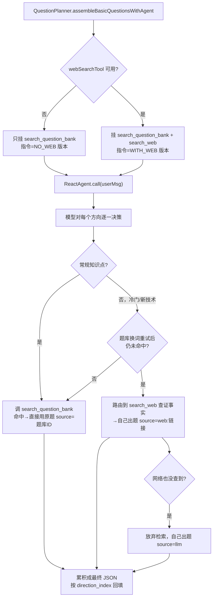

# B1 升级：出题 Agent 从纠正式（Corrective）升级为 Router + Corrective 复合形态

> 定位：本文档记录**一次具体的迭代改动**（不是路线图待办），格式沿用 `迭代交接文档.md` 的
> "做了什么 → 为什么这么设计 → 涉及文件"三段式，并补充分类定位判断（面向简历/面试展示）。
>
> 前置基线：`优化路线图与简历亮点方案.md` 的 **B1** 条目（把题库检索的手写 pipeline
> 改造成 ReactAgent 自主 Tool-use）已经完成，出题 Agent 当时只有 `search_question_bank`
> 一个工具，属于**单一来源内部的纠正式（Corrective）闭环**：检索 → 自评相关性 → 不满意换词
> 重试（最多1次）→ 仍不满意则放弃检索、转 LLM 参数化知识自己出题。
>
> 本次改动在此基础上，给出题 Agent 挂上**第二个、异构的检索源**（公开网络），
> 使其具备真正的"路由"语义。

---

## 1. 背景问题

升级前的出题 Agent 面前始终只有 1 个工具（`search_question_bank`），所有决策都发生在
"这一个来源给的结果能不能用"这个层面——按 Agentic RAG 综述（Singh et al., *Agentic RAG:
A Survey*）的分类标准，这只能算 **Single-Agent Agentic RAG** 里的 **Corrective/Self-Reflective**
子类型，够不上 **Router** 子类型——Router 特指"面前有 ≥2 个异构检索源/工具，agent 要先决定
路由到哪一个"，而不是"只有 1 个来源，决定信不信/要不要重试"。

同时存在一个真实的业务痛点：题库覆盖的是候选人专属的固定题目集合，遇到**冷门/新出现的
技术点**（比如某框架的新版本特性、小众开源项目）时，题库检索不到、模型自身知识也可能过时，
容易凭空编造错误的技术细节。

## 2. 要做什么

给出题 Agent 新增一个工具 `search_web`（公开网页检索），并在指令里明确划出两个来源的
**路由边界**——不是让模型无脑双搜，而是有优先级、有触发条件的路由：

- `search_question_bank` 永远是**首选/权威来源**（候选人专属、审核过的原题）；
- `search_web` 只在**"题库换词重试后仍未命中" + "该方向涉及模型自己把握不准的新/冷门
  技术点"**同时满足时才路由过去，且只用于**查证事实、辅助自己出题**，不能拿网页内容
  直接当题目照搬。

## 3. 技术实现

### 3.1 新增第二个异构工具源：`WebSearchTool`

文件：`mcp/WebSearchTool.java`

- 检索源选型：**博查AI搜索**（`api.bochaai.com/v1/web-search`）而非更常见的 Tavily——
  项目里其余外部依赖（DashScope、Milvus）都是国内可直连服务，检索源选型延续同一原则，
  避免引入跨境访问不稳定的风险，这本身是一个真实的工程取舍点。
- 用 Java 11 原生 `HttpClient` 发 POST 请求，`Jackson` 解析响应里的
  `data.webPages.value[]`（`name`/`url`/`summary`）。
- 与已有的 `GitHubTool` 同一套**"可选工具"模式**：
  ```java
  @Component
  @ConditionalOnProperty(prefix = "app.websearch", name = "api-key", matchIfMissing = false)
  public class WebSearchTool { ... }
  ```
  不配置 `BOCHA_API_KEY` 时该类根本不会注册成 Spring Bean，`QuestionPlanner` 里对应字段
  （`@Autowired(required = false)`）自动是 `null`，出题 Agent 退化为升级前的单来源版本，
  **不因为多加一个工具而让主流程变脆弱**。
- 复用 `GitHubTool` 的健壮性写法：
  - **本地缓存**（`ConcurrentHashMap` + 10 分钟 TTL），同一关键词短时间内不重复打外部 API；
  - **"查无结果" vs "工具故障"分开提示**：网络异常时返回的文案明确告知模型"工具当前不可用，
    别再重试，直接结合已有知识出题"，避免模型把临时故障误判为"这个技术点没资料"而反复重试；
  - 故障响应不进缓存，避免短暂抖动被当成长期结论。
- 暴露为 `ToolCallback`：
  ```java
  public ToolCallback asRouterTool() {
      return FunctionToolCallback
              .builder("search_web", (SearchRequest req) -> { ... })
              .description("检索公开网页获取技术资料...仅当题库检索未命中，"
                      + "且该考察方向涉及你把握不准的新/冷门技术细节时才调用...")
              .inputType(SearchRequest.class)
              .build();
  }
  ```

### 3.2 `QuestionPlanner` 的路由接线

文件：`agent/QuestionPlanner.java`

**指令拼接**：把原来一段固定的 `BASIC_QUESTION_GROUP_AGENT_INSTRUCTION` 拆成 4 段模板常量，
按 `hasWebSearch` 布尔值动态组合：

```java
BASE                    // 题库工具说明（首选来源）
+ WEB_PART (可选)        // 网页工具说明 + 触发路由的两个条件
+ TAIL_COMMON           // direction_index 回填规则、方向数量必须对应等通用约束
+ OUTPUT_WITH_WEB / OUTPUT_NO_WEB   // 输出 JSON schema，source 取值多了 "web:<链接>"
```

```java
private static String buildGroupAgentInstruction(boolean hasWebSearch) {
    if (hasWebSearch) {
        return BASE + WEB_PART + TAIL_COMMON + OUTPUT_WITH_WEB;
    }
    return BASE + TAIL_COMMON + OUTPUT_NO_WEB;
}
```

**工具列表与指令严格同步**：

```java
boolean hasWebSearch = webSearchTool != null && webSearchTool.isAvailable();
List<ToolCallback> tools = new ArrayList<>();
tools.add(questionBankTool.asQuestionAssemblyTool(userId));
if (hasWebSearch) {
    tools.add(webSearchTool.asRouterTool());
}

ReactAgent agent = ReactAgent.builder()
        .name("question_assembler_group")
        .model(chatModel)
        .instruction(buildGroupAgentInstruction(hasWebSearch))
        .tools(tools)
        .build();
```

**关键约束**：发给模型的工具能力描述必须与实际绑定的 `tools` 列表严格一致——两处判断都用
同一个 `hasWebSearch` 变量，避免出现"指令里提到了 `search_web`，但工具列表里没挂"导致模型
尝试调用一个不存在的工具而报错。

### 3.3 输出协议扩展

`source` 字段的取值从两种（题库ID / `llm`）扩展为三种：

| source 取值 | 含义 |
|---|---|
| `题库原题ID` | 直接使用题库检索到的原题（`content` 完全照搬） |
| `web:<链接>` | 题库未命中 + 冷门技术点，路由到网络查证后模型自己组织出题 |
| `llm` | 两个来源都没查（或都不需要查），模型依据参数化知识自行出题 |

回填逻辑（`assembleBasicQuestionsWithAgent`，按 `direction_index` 精确对应，不依赖数组顺序）
不需要改动，`source` 只是多了一种字符串格式，下游消费方按需处理即可。

## 4. 决策流程图



## 5. Mock 走一遍完整决策轨迹

以 `hard` 档 3 个方向为例：

| 方向 | 考点 | 决策轨迹 | 最终 source |
|---|---|---|---|
| A（index=0） | JVM GC 原理 | 常规知识 → 调 `search_question_bank` 一次命中（相似度0.87）→ **不调用** `search_web` | `q_10234` |
| B（index=1） | Spring AI Alibaba ReactAgent 底层实现 | 冷门新技术 → `search_question_bank` 两次换词均未命中 → 触发路由条件 → 调 `search_web` 拿 3 条摘要 → 依据摘要自己出题 | `web:https://xxx.com/...` |
| C（index=2） | 分布式锁的可重入实现 | 常规知识，模型自身知识足够 → 未调用任何工具，直接出题（合法路径，指令未强制检索） | `llm` |

一次 agent 会话内共发生 3 次 `search_question_bank` 调用 + 1 次 `search_web` 调用，
最终一次性返回：
```json
{"questions":[
  {"direction_index":0,"source":"q_10234", ...},
  {"direction_index":1,"source":"web:https://xxx.com/...", ...},
  {"direction_index":2,"source":"llm", ...}
]}
```

## 6. 分类定位（面向面试展示）

**仍然是 Single-Agent Agentic RAG**（不是 Multi-Agent）——决策权始终集中在同一个
`question_assembler_group` 这一个 ReactAgent 身上，两个工具本身没有独立的决策循环，
调不调、调几次、信不信结果全由这一次 ReAct 会话内部决定；按难度分 3 组也只是同一个
agent 角色处理 3 批输入，不构成"多个不同职责 agent 协作"。

**升级为 Router + Corrective 复合子类型**：

> 单一 agent 先在【专属题库】和【公开网络】两个异构来源之间做路由决策（Router 语义）；
> 路由到具体某个来源之后，内部仍保留原有的"检索 → 自评相关性 → 换词重试 → 放弃转
> 参数化生成"纠正循环（Corrective 语义）。

以及两个工具本身的性质区分（容易被面试官追问）：

| Tool | 是否严格意义 RAG | 原因 |
|---|---|---|
| `search_question_bank` | 是 | 检索出的内容可以**直接当最终答案**（原题照搬） |
| `search_web` | 不是 | 检索出的是**辅助查证信息**，不能直接当答案，模型仍需自己组织生成 |

## 7. 面试话术

> "出题 Agent 是一个 ReactAgent，一开始只有题库检索这一个工具，属于纠正式 Agentic RAG：
> 自己决定检索词、判断结果相关性、不够就换词重试、还不够就放弃检索转参数化生成。后来我
> 给它加了第二个异构来源——网页搜索，让它在'专属题库'和'公开网络'之间做真正的路由决策，
> 升级成 Router + Corrective 的复合形态。路由边界完全靠 prompt 工程实现，没写一行
> if-else：只有题库换词重试后仍未命中、且涉及冷门新技术点，才会路由到网络，网络结果也
> 只能用来查证事实、不能直接当题目照搬。工程上保证降级安全——没配 API Key 时，工具列表
> 和指令文案用同一个布尔标志同步切换，退化为升级前的单来源版本，不会出现'模型以为有这个
> 能力但实际调不到'的错配。"

## 8. 涉及文件清单

| 文件 | 改动性质 |
|---|---|
| `mcp/WebSearchTool.java` | 新增（博查AI搜索，可选工具，同 `GitHubTool` 模式） |
| `agent/QuestionPlanner.java` | 新增 `webSearchTool` 字段、指令拆分为4段模板动态拼接、工具列表按可用性同步挂载 |
| `config/AppConfig.java` | 新增 `WebSearchProperties`（`app.websearch.api-key`） |
| `resources/application.yml` | 新增 `app.websearch.api-key: ${BOCHA_API_KEY:}` |
| `.env.example` | 新增 `BOCHA_API_KEY` 示例配置 |

## 9. 已知限制 / 下一步可做

- 目前仍是 **Single-Agent**：决策权集中在一个 agent 身上，"路由"和"出题"两件事没有
  拆成独立角色。若要升级到 **Multi-Agent Agentic RAG**，可以拆成：
  - **检索决策 Agent**：只负责"这个方向该查哪个源、查不查、查到的资料是否可信"，
    产出结构化的"检索结论"（用哪个来源、依据是什么）；
  - **出题 Agent**：只负责"拿到检索结论后组织出最终题目"，不自己决定要不要检索。
  两者通过消息/结构化产物协作，而不是同一个 agent 内部一次 ReAct 会话包办到底——
  这才是 Multi-Agent 的核心语义（多个不同职责角色协作），是下一步可以推进的方向。
- `search_web` 的"是否路由"目前完全靠 prompt 里的自然语言条件约束模型自律，没有代码层
  的强制校验（比如统计"这一档里有多少方向触发了网络检索"做异常告警），模型偶发过度调用
  或该调用时没调用，目前无法从代码层面兜底发现。
- 博查AI搜索目前没有做"结果质量过滤"（比如按域名白名单过滤官方文档站点、按时间过滤
  过时内容），后续可参考 `GitHubTool` 已有的"排除 fork 仓库、过滤不维护项目"思路补上。
