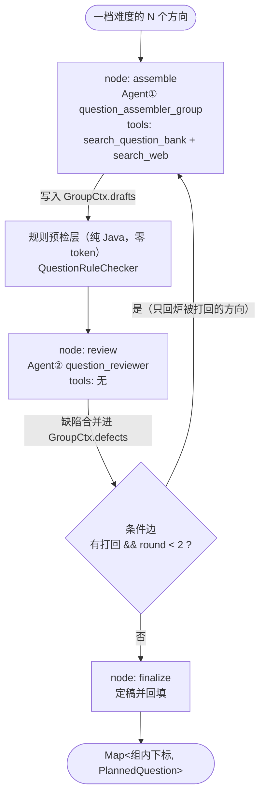

# B4 升级：Multi-Agent 出题-审题回环（Assembler + Critic）

> 上一版（B1 + Router 升级）见 `docs/B1升级-Router模式与WebSearchTool.md`。
> 本文记录把出题环节从 **Single-Agent** 升级为 **Multi-Agent 协作**的完整设计与落地。

---

## 1. 升级前的状态与问题

B1 + Router 升级后，出题环节是一个 **Single-Agent Agentic RAG（Router + Corrective 复合子类型）**：

```
question_assembler_group（一个 ReactAgent，一档一次会话）
  ├─ tool: search_question_bank  （RAG，查专属题库拿真实原题）
  └─ tool: search_web            （辅助检索，查证冷门技术点）
```

它能自主决定"该不该检索、查题库还是查网络、要不要换词重试、都不满意就自己出题"。

但它有一个**结构性缺陷：出题者同时充当自己的质检员**。由此带来两类问题：

### 1.1 确认偏差（动机层面）

"生成"和"批判"是天然对立的两种立场。让同一个 agent 评价自己刚写出来的题，它几乎总会认为自己写得没问题——这是 LLM 自评的已知失败模式，也是 Reflexion / Constitutional AI 之所以要引入独立 Critic 角色的原因。

### 1.2 结构上就发现不了的问题（能力层面）

比动机问题更硬的是：有几类缺陷，单 agent 在这个架构下**根本没有机会发现**。

| 缺陷 | 为什么单 agent 发现不了 |
|---|---|
| **跨方向重复** | 题库检索是**逐方向独立**进行的。"MySQL索引优化"和"MySQL B+树结构"这类邻近方向，很容易检索命中实质相同的原题。但出题 agent 的注意力始终在"逐个方向查库"这条流水线上，不会主动回头做全局比对 |
| **难度名不副实** | 题库原题的 `difficulty` 是**题库自己标的**。照搬进来，可能一个 `hard` 方向拿到了一道实际只考 API 用法的题，直接破坏 `StageScheduler` 依赖的难度梯度与 `adjustDifficulty` 的动态调节效果 |
| **事实性风险** | `source=web` 的题依据的是网页摘要（可能过时/片面），`source=llm` 的题可能有幻觉。出题者自己校验自己天然不可靠 |
| **追问不递进** | `follow_ups` 应当比主问更深一层，而不是换个说法重复问同一件事 |

**结论**：需要引入一个与出题者职责对立的独立角色。

---

## 2. 为什么选 Assembler + Critic，而不是 Retriever + Generator

落地前评估过另一个更"教科书"的拆法——把现有 agent 拆成"检索决策 Agent"和"出题 Agent"（Retriever / Generator 职责分离）。**最终否决了它**，原因值得记录，因为这是一次真实的设计取舍：

**否决理由：题库命中路径上，Generator 近乎透传。**

题库检索命中时，指令要求"content 完全照搬不得改编"，Generator 拿到 evidence 后几乎没有生成空间，剩下的只有"补追问 + 整理参考答案 + 校准难度"这类格式化工作。对一档 5 个方向、其中 3 个命中题库的典型情况，Generator 的实际工作量很薄——**两个 agent 的职责重叠（都在"出题"）**，面试时一问"那你第二个 agent 到底干了什么"就答不上来。

**对比：**

| | Retriever + Generator | Assembler + Critic（采用） |
|---|---|---|
| 职责重叠 | 有（题库命中时 Generator 近乎透传） | 无（生成 vs 批判，天然对立） |
| 是否有回环 | 单向流水线（除非硬加） | 天然双向 |
| 对现有代码改动 | 大（现有 agent 要拆两半、instruction 重写） | 小（现有 agent 完全不动，只新增角色 + 一层图） |
| 实际质量收益 | 不明显 | 明显（去重 + 难度校准 + 事实标记都是真实痛点） |
| 论文背书 | RAG 经典两段结构 | Reflexion / Constitutional AI / Actor-Critic |

---

## 3. 最终架构：三层职责 + 带回环的 StateGraph



**粒度**：一个难度档一张图（沿用 B1 的"一档一次会话"），三档三次 `compiledGraph.invoke()`。

**对外契约完全不变**：`assembleBasicQuestionsWithAgent(dirs, userId)` 的签名与返回值一字未改，`Orchestrator` 只同步了注释和一句前端提示文案，**业务逻辑零改动**。

### 三层职责边界

| 角色 | 位置 | 工具 | 只做什么 | 明确不做什么 |
|---|---|---|---|---|
| **Agent① 出题** | `assemble` 节点 | 题库 + 网络 | 检索、选源、产出题目、按打回理由重出 | 不评判自己的题 |
| **规则预检** | `review` 节点内，Critic 之前 | — | 机械可判定的硬错误 | 不做任何语义判断 |
| **Agent② 审题** | `review` 节点 | **无** | 语义层面的质量批判 | 不改题、不重出题 |

> 注意：三者中只有 Agent① 和 Agent② 是 Agent，规则预检层是纯 Java 静态工具类（无 LLM、无 prompt、非 Spring Bean），不应被算作第三个 Agent。

---

## 4. 为什么在两个 Agent 之间插一层规则预检

草稿里的缺陷分两类，混在一起交给 Critic 是浪费且不可靠的：

- **机械可判定**：难度标注与方向要求不一致、`follow_ups` 为空、`reference`/`source` 缺失、题干过短（输出截断）、跨方向题干文本近重复
- **必须理解语义**：考点是否跑偏、难度是否名副其实、追问是否递进、事实是否可疑、语义是否重复

把前者剥离到纯 Java 层（`QuestionRuleChecker`）有三个收益：

1. **省 token**：这部分打回理由完全不需要模型参与
2. **零误判**：LLM 判"两道题是否重复"有随机性，而归一化后的 bigram Jaccard 相似度是确定的
3. **Critic 的 prompt 更专注**：指令更短、注意力集中在真正需要理解的维度上

这套"规则自检 → 缺口回喂模型"的思路复用自 `ReviewPlanner` 的 B2 反思循环（`findUncoveredHighPriorityAreas`），这次把它抽成了一个可独立单元测试的组件。

### 4.1 重复判定为什么用 bigram Jaccard

选它而不是整串相等或编辑距离：中文题干里"MySQL 索引失效的场景有哪些"和"哪些场景会导致 MySQL 索引失效"是同一道题的不同措辞，整串比对判不出来；bigram 集合重叠度能捕捉同义换序，且对长度差异不敏感。

### 4.2 阈值 0.6 是刻意保守的（一个真实的分层边界）

落地时实测发现：上面那对同义换序句子的 bigram 相似度只有约 **0.5**，低于 0.6 阈值，**规则层不会报**。

这不是 bug 而是设计取舍，并且已写进单元测试固化下来（`check_reorderedDuplicate_leftToCritic`）：

> 规则层的定位是"零误判地兜住几乎肯定重复的情况"（最典型的是同一道题库原题被两个邻近方向同时命中）。一旦为了抓住这种换序把阈值调低，就会开始误伤考点相邻但确实不同的题目。而**误判的代价比漏判更高**——合格的题被白白打回重出，既烧 token 又可能越改越差。因此"措辞不同、考点相同"的语义重复**故意留给审题 Agent**，那是它擅长而规则层做不到的事。

**分层的意义正在于此：规则层要零误判，Critic 负责理解语义。**

---

## 5. 通信机制：两个通道，分工明确

这是整个设计里最需要讲清楚的部分。

### 5.1 横向（跨 Agent）：Blackboard 模式，传结构化数据

两个 agent 之间**不做自然语言协商**，而是通过结构化数据传递，以 `direction_index` 作为 join key。

**为什么**：出题是**确定性生成任务**，需要可校验、可精确回填、可落库审计的数据。如果走自然语言消息，模型说"第三道题有问题"，你还得去猜它数的是哪一道——而结构化 verdict 里的 `direction_index=2` 是无歧义的。

两类缺陷归一化成同一个结构 `QuestionDefect`：

```java
{
  directionIndex: 2,
  origin: RULE | CRITIC,        // 来源，便于日志区分
  reason: "具体问题描述",         // 会原样回喂给出题 Agent
  suggestion: "改进方向"          // Critic 通常会给，规则层多为空
}
```

出题 Agent 收到时无需关心某条意见来自规则层还是 Critic，两者已合并。

### 5.2 纵向（单 Agent 跨轮）：对话历史累积

**回炉时必须复用同一个 agent 实例 + 累积的 `List<Message>` history**，把打回理由作为新的 `UserMessage` 追加进去，而不是 new 一个新 agent。

**为什么**：新实例看不到自己上一轮的产出，只能凭打回理由瞎猜。复用 history 后，模型看到的是"我上一轮给出的题 + 收到的审核意见"，才能有针对性地重出。写法与 `ReviewPlanner.generateWithReactAgent` 的 B2 反思循环一致。

### 5.3 为什么业务对象不能放进 Graph State

`Orchestrator` 的注释里已踩过这个坑：**graph 在执行节点前会对 `OverAllState` 做序列化快照**，因此 `ReactAgent` 实例、`Message` 对话历史、草稿对象都不能进 state。

处理方式与 `Orchestrator.Ctx` 完全一致——state 只承载纯数据（`round` / `defect_count`，供条件边与日志使用），业务对象放在一个由节点闭包捕获的 `GroupCtx` 持有者里共享。

---

## 6. 权限边界：Critic 没有任何工具

**Critic 不持有任何工具**，这是一个刻意的设计：

- 去重、难度校准、追问递进判断都是 **in-context** 的（本档所有题目都在同一个 payload 里），不需要外部检索
- 事实性校验理论上可以给 Critic 挂 `search_web`，但那会让"审题"变慢变贵，与"Critic 应该快而便宜"的定位矛盾

**折中做法**：Critic 只负责**标记**"此处存疑"（在 reason 里写明"哪一处技术细节存疑、需要查证什么"），把真正的查证动作**交还给带工具的出题 Agent** 去做。

> **检索权只归出题者，判断权只归审题者。**

这个边界让两边的 prompt 都很干净，也避免了两个 agent 都能改动同一批数据带来的状态混乱。

同理，**Critic 只判不改**：绝不直接修改题目、也不重新出题，只输出 pass/reject + 理由 + 建议。改动权始终在出题 Agent 手上——否则"谁产出最终题目"会变得不确定，`source` 字段的可信度也会被破坏。

### 6.1 为什么 Critic 用单轮 `chatModel.call` 而不是 `ReactAgent`

正因为它没有工具，就不存在"思考 → 调工具 → 观察 → 再思考"的 ReAct 循环——**一次调用就能拿到全部判定**。

初版实现里图省事，用 `ReactAgent` 包了一个空工具列表（`.tools(List.of())`），后来改掉了。用 `ReactAgent` 的实际代价：

1. **多建一张 StateGraph**：`ReactAgent` 构造时会 `initGraph()` 建 llm / tool 节点与边再 `compile()`；而 Critic 是每轮新建实例的，这个开销每轮都要付一次
2. **多绕一层 graph runner**：进 runner → llm 节点 → 判断有无 tool_calls（必然没有）→ 走到 END，中间全是空转
3. **多一层异常包装**：真实的模型调用异常被 `GraphRunnerException` 包在外面，日志与排查都多一层
4. **误导读者**：看到 `.tools(List.of())` 会以为这里需要工具调用能力

改为与 `JDAnalyzer` / `Evaluator` 等单轮 Agent 一致的写法：instruction 作 `SystemMessage`、待审批次作 `UserMessage`，一次 `chatModel.call(prompt)` 拿结果。

**这不影响它作为独立 Agent 角色的地位**——"是不是 Agent"取决于**决策权**（它有自己的 instruction、独立的批判立场、结构化的判定输出，与出题 Agent 构成协作），而不取决于用了框架里哪个类。只是它的决策不需要多轮工具循环来支撑。

> 反过来说，这也解释了为什么出题 Agent 必须是 `ReactAgent`：它要在一次会话里对多个方向反复调用检索工具、依据返回结果决定是否换词重试或改用另一个数据源，这正是 ReAct 循环存在的意义。

---

## 7. 关键工程约束

### 7.1 只回炉被打回的方向

一档 5 道题里 3 道合格的没必要重新生成：省 token、省检索调用，也避免"重出时把原本好的题改坏"这种回归风险。重出消息里显式写明"其余方向已通过审核，不要重复输出"。

### 7.2 回环的真实价值：驱动新一轮检索，而非重写文本

重出消息里明确允许并鼓励重新调用检索工具：

```
如果打回原因涉及"题库原题不合适/与其他方向重复/技术细节存疑"，你可以并且应该
【重新调用检索工具】——换一个更贴合的关键词再查题库，或用网页检索去查证存疑的
技术细节，而不是只把原来的文字换个说法。
```

例如"方向4与方向1重复"这条理由，会让它换关键词重新调 `search_question_bank("索引失效场景")`。**这是单 agent 自评做不到的**——自评时它没有动机认为自己需要重查。

### 7.3 source 字段的诚实性底线

重出消息里强制约束：

> 若保留了某道题库原题的原文，`source` 仍填该题库 ID；若对题干做了**任何改编**，或改为自行出题，`source` 必须改成 `"llm"`（或 `"web:<链接>"`）。**严禁改编了原题内容却仍然标注题库 ID。**

**为什么这条是底线**：`Orchestrator.buildWeakReviewContent` 会依据 `source` 回题库取参考答案用于低分题巩固。一旦题干被改编却仍标着题库 ID，取回的答案就和题目对不上了。

### 7.4 `MAX_REVIEW_ROUNDS = 2`

与 `ReviewPlanner.MAX_REFLECT_ROUNDS` 保持一致。

**为什么必须截断**：LLM 做 Critic 时有一个常见失败模式——"总能再挑出点毛病"。不设上限会导致无限回炉、token 爆炸、面试迟迟无法开始。第 2 轮之后即便仍有打回意见也直接采纳当前草稿。

### 7.5 全程 Fail-open

这是与 B1 一致的降级哲学：**审题是质量增强，不是准入门槛。**

| 失败点 | 行为 |
|---|---|
| Critic 模型调用异常 | 返回空缺陷列表，视为全档通过，打 warn |
| Critic 输出无法解析 | 同上 |
| Critic 打回但未给理由 | 忽略该条（没理由无法回喂，出题 Agent 不知道要改什么） |
| Critic 返回非法 `direction_index` | 忽略该条 |
| 重出时出题 Agent 调用失败 | 保留上一轮草稿 |
| 轮次耗尽仍有打回 | 采纳当前版本，日志记录未消化的意见数便于复盘 |
| 整张图抛异常 | 返回空 map，由 `Orchestrator` 整组降级为传统 pipeline（B1 既有路径） |

**绝不能因为 Critic 挂了就让整场面试没题可问。**

### 7.6 Critic 的审核纪律（防过度严苛）

Critic 的 instruction 里专门写了一段"审核纪律"，因为 LLM 做 Critic 时天然倾向于"为了显得严格而挑毛病"：

- 只有确实存在既定维度问题时才打回；措辞风格偏好、"还能更好"、题目稍显平淡等主观不满**都不构成打回理由**
- 打回理由必须**具体且可执行**，不许写"题目质量不高""建议优化"这类空话
- 一道题有多个问题合并成一条，不拆成多条
- **"如果整批题目都没问题，就全部判 pass，这是完全正常且值得肯定的结果"** —— 显式给模型"可以全部通过"的许可，这一句对抑制过度严苛很关键

---

## 8. 完整流转示例（一档 hard，5 个方向）

**Round 1**

| 步骤 | 发生了什么 |
|---|---|
| `assemble` | Agent① 对 5 个方向依次检索：0/1/3 命中题库原题，2 走 `search_web` 查证后自行出题，4 无结果自行出题 → 写入 `GroupCtx.drafts` |
| 规则预检 | 方向3 的 `follow_ups` 为空 → 1 条 `RULE` 缺陷 |
| Critic | 方向2 标 hard 但实际只考 API 用法（难度虚高）、方向4 与方向1 语义重复 → 2 条 `CRITIC` 缺陷 |
| 条件边 | 缺陷非空（2/3/4）且 `round=1 < 2` → 回到 `assemble` |

**Round 2**

| 步骤 | 发生了什么 |
|---|---|
| `assemble` | **只把 2/3/4 + 对应理由**追加进 history 重出。方向4 的理由是"与方向1重复"，Agent① 于是换关键词重新调 `search_question_bank("索引失效场景")`；方向2 重新组织成考察底层实现的题；方向3 补上追问 |
| `review` | 规则层与 Critic 均无异议 |
| 条件边 | 无缺陷 → `finalize` |

**finalize**：按 `direction_index` 回填成 `Map<Integer, PlannedQuestion>` 返回。未被覆盖的下标照旧由 `Orchestrator` 走传统 pipeline 降级。

---

## 9. 架构定位的变化

| | 升级前（B1 + Router） | 升级后（B4） |
|---|---|---|
| Agent 数量 | 1（`question_assembler_group`） | 2（`question_assembler_group` + `question_reviewer`） |
| 分类 | Single-Agent Agentic RAG（Router + Corrective） | **Multi-Agent Agentic RAG**（Router + Corrective + **Critic 回环**） |
| 协作模式 | — | Blackboard（结构化数据 + `direction_index` 作 join key） |
| 编排方式 | 一次 `agent.call()` | `StateGraph` 带条件回环（复用 `Orchestrator` 同一套图引擎） |
| 质检 | 出题者自评（存在确认偏差） | 独立 Critic + 规则预检两级 |

**Multi-Agent 的判定依据**：现在存在两个**职责不同、立场对立**的独立 agent 角色（生成 vs 批判），各自有独立的 instruction、独立的工具权限（一个有检索权、一个没有）、独立的输出结构，通过结构化数据协作并形成回环。这符合 Multi-Agent 的核心定义——而不是"同一个角色处理多批输入"。

**故事延续性**：这套多 agent 协作复用了 `Orchestrator` 已在用的同一个 `StateGraph` 引擎，从宏观的 6 阶段面试流程编排，下沉到微观的出题内部协作。

---

## 10. 涉及文件清单

| 文件 | 改动 |
|---|---|
| `model/QuestionDefect.java` | **新增**。规则层与 Critic 的统一缺陷结构（`directionIndex` / `origin` / `reason` / `suggestion`） |
| `agent/QuestionRuleChecker.java` | **新增**。纯 Java 规则预检层：硬字段校验 + 难度一致性 + bigram Jaccard 近重复 |
| `agent/QuestionReviewer.java` | **新增**。审题 Agent（Critic）：无工具、单轮 `chatModel.call`、只判不改、fail-open |
| `agent/QuestionPlanner.java` | **改造**。`assembleBasicQuestionsWithAgent` 内部改为 `StateGraph`（assemble / review / finalize + 条件回环），新增 `GroupCtx` 上下文持有者、`buildReworkMessage` 等 |
| `graph/Orchestrator.java` | **仅注释与一句前端提示文案**，业务逻辑零改动（对外契约未变） |
| `test/.../QuestionRuleCheckerTest.java` | **新增** 8 个用例，含"同义换序故意不报"的分层边界固化 |

**验证**：`mvn test` 31 个用例全绿；`mvn compile` 通过。

> 注：本机 `JAVA_HOME` 指向 JDK 22，而 Lombok 1.18.30 不兼容 JDK 22，编译需指定 JDK 21（`JAVA_HOME=.../openjdk@21 mvn compile`）。这是既有环境问题，与本次改动无关。

---

## 11. 面试话术

> "出题环节我从单 agent 拆成了 Assembler + Critic 两个 agent，用 StateGraph 建了一张带条件回环的小图。
>
> **为什么要拆**：原来出题者同时充当自己的质检员，一是有确认偏差，二是有几类问题它结构上就发现不了——题库检索是逐方向独立进行的，邻近方向很容易命中实质相同的原题，但它的注意力始终在逐个查库，不会回头做全局比对；题库原题的难度是题库自己标的，照搬进来可能一个 hard 方向拿到一道只考 API 用法的题，直接破坏我们依赖难度分档抽题的调度器。
>
> **为什么选这个拆法**：我先评估过更教科书的 Retriever/Generator 拆法，但否决了——题库命中时要求原题照搬，Generator 就近乎透传，两个 agent 的职责重叠在'出题'上。而生成和批判是天然对立的立场，这才是多 agent 分工的正当理由。
>
> **协作机制**：走 Blackboard 而不是 agent 间对话——出题是确定性任务，需要以 direction_index 为 join key 的结构化 verdict，自然语言消息无法精确定位是哪一道题。另外还有第二个通道：出题 agent 的对话历史跨轮累积，重出时复用同一个实例，它才能看到自己上一轮写了什么。
>
> **三个工程决策**：一是在两个 agent 之间插了一层纯规则预检，机械可判定的错误不花模型的钱，还避免了 LLM 判重的随机误判；这里有个有意思的取舍——同义换序的相似度只有 0.5，我故意不调低阈值去抓它，因为误判让合格题白白重出的代价比漏判更高，这类语义重复留给 Critic。二是只回炉被打回的方向，且打回理由能驱动出题 agent 重新检索而不只是重写文本。三是全程 fail-open，Critic 挂掉或轮次耗尽一律接受草稿，因为审题是质量增强而不是准入门槛。
>
> **权限边界**：Critic 没有任何工具，只有判断权没有检索权——发现事实存疑时它只标记'这里需要查证什么'，真正的查证交还给带工具的出题者。这让两边的 prompt 都很干净，也避免两个 agent 都能改同一批数据。也正因为它没有工具、不需要 ReAct 循环，实现上就是一次单轮 chatModel 调用，而不是套一个空工具列表的 ReactAgent——是不是 Agent 取决于决策权，不取决于用了框架里哪个类。"

---

## 12. 下一步可做

- **Critic 判定落库**：把每轮 verdict（含 `origin` / `reason`）持久化，就能统计"哪类缺陷最常出现""哪个来源的题被打回率最高"，形成出题质量的可观测指标
- **差异化配模型**：Critic 只做判断不做生成，可以挂更便宜/更快的模型，出题 agent 保持强模型——这是职责拆分后自然获得的成本优化空间（Critic 走单轮 `chatModel.call`，只需在 `Prompt` 里带上独立的 `ChatOptions` 即可指定模型）
- **experience / design 类方向纳入审题**：目前只有 basic 类走 agent 出题，其余仍是单轮 LLM 兜底，可以复用同一套 Critic
- **`ReviewPlanner` 是否也引入 Critic**：评估结论是暂不改造——它的 4 个工具是并列的信息增强关系，不存在"某来源结果可直接当最终答案"的路由语义，且 B2 已有规则反思循环，收益不明显
